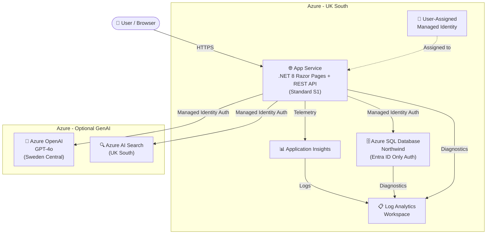

# App-Mod-Booster — Expense Management

A modernised cloud-native Expense Management application built on Azure, demonstrating how GitHub Copilot can transform a legacy application into a fully cloud-ready solution.

## Architecture



### Key Architecture Decisions

| Decision | Approach |
|----------|----------|
| **Authentication** | User-assigned Managed Identity — no passwords or secrets |
| **SQL Auth** | Entra ID only (no SQL username/password) |
| **Data Access** | All DB access via Stored Procedures |
| **Monitoring** | Log Analytics + Application Insights |
| **AI Chat** | Azure OpenAI GPT-4o with function calling |

## Quick Start

### Prerequisites

- [Azure CLI](https://docs.microsoft.com/en-us/cli/azure/install-azure-cli) (`az login`)
- [go-sqlcmd](https://github.com/microsoft/go-sqlcmd) (`winget install sqlcmd`)
- [.NET 8 SDK](https://dotnet.microsoft.com/download/dotnet/8)
- PowerShell 7+ recommended

### Two-Phase Deployment

#### Phase 1: Deploy Infrastructure

```powershell
# Deploy without AI chat
.\deploy-infra\deploy.ps1 -ResourceGroup "rg-expensemgmt-20240101" -Location "uksouth"

# Deploy with AI chat (Azure OpenAI + AI Search)
.\deploy-infra\deploy.ps1 -ResourceGroup "rg-expensemgmt-20240101" -Location "uksouth" -DeployGenAI
```

This creates all Azure resources, imports the database schema, deploys stored procedures, and configures App Service settings automatically.

#### Phase 2: Deploy Application

```powershell
# No parameters needed — reads .deployment-context.json automatically
.\deploy-app\deploy.ps1
```

### Application URLs

After deployment, visit:

- **Dashboard**: `https://<app-name>.azurewebsites.net/Index`
- **Swagger API**: `https://<app-name>.azurewebsites.net/swagger`
- **AI Chat**: `https://<app-name>.azurewebsites.net/Chat`

## Features

- 📊 **Dashboard** — Expense stats, status breakdown, recent activity
- 📋 **Expense List** — View and filter all expenses by status
- ➕ **Create Expense** — Submit new expense claims
- ✅ **Manager Approvals** — Review and approve/reject submitted expenses
- 🤖 **AI Assistant** — Natural language interface with function calling
- 🔌 **REST API** — Full Swagger documentation at `/swagger`
- 🔍 **Error Handling** — Graceful fallback with dummy data when DB is unavailable

## CI/CD with GitHub Actions

See [`.github/CICD-SETUP.md`](.github/CICD-SETUP.md) for instructions on setting up automated deployments with OIDC federation.

## Repository Structure

```
├── Database-Schema/          # SQL Server schema
├── Legacy-Screenshots/       # Original app screenshots
├── stored-procedures.sql     # All stored procedures
├── deploy-infra/             # Bicep templates + infra deployment script
│   ├── main.bicep
│   ├── main.bicepparam
│   ├── deploy.ps1
│   └── modules/
│       ├── app-service.bicep
│       ├── azure-sql.bicep
│       ├── managed-identity.bicep
│       ├── monitoring.bicep
│       └── genai.bicep
├── deploy-app/               # App deployment script
│   └── deploy.ps1
├── src/ExpenseManagement/    # ASP.NET 8 application
│   ├── Controllers/          # REST API controllers
│   ├── Pages/                # Razor Pages UI
│   ├── Services/             # Business logic + AI chat
│   └── Models/               # Data models
└── .github/
    ├── workflows/deploy.yml  # GitHub Actions workflow
    └── CICD-SETUP.md         # CI/CD setup guide
```

## Supporting slides for Microsoft Employees
[Here](<https://microsofteur-my.sharepoint.com/:p:/g/personal/dchisholm_microsoft_com/IQAY41LQ12fjSIfFz3ha4hfFAZc7JQQuWaOrF7ObgxRK6f4?e=p6arJs>)
